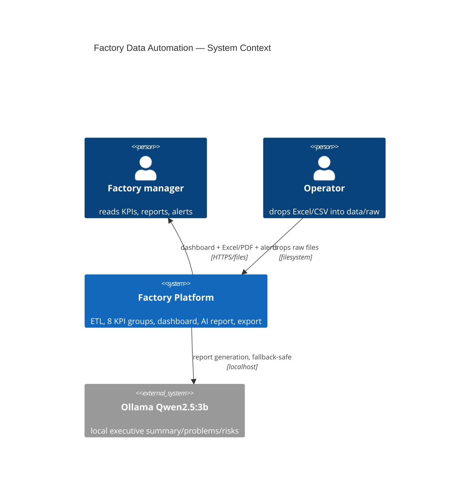
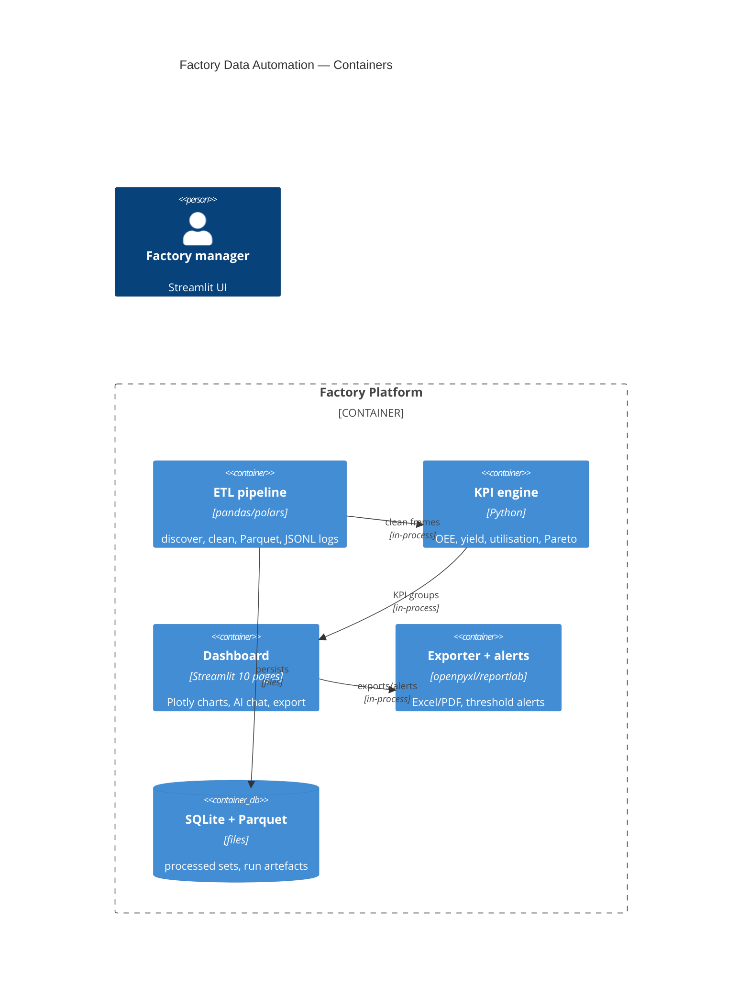

# Factory Data Automation — C4 Architecture

> Source of truth: `Factory-…/README.md` architecture
> (files → ETL → clean → KPI → dashboard/AI report → export + alerts).

## C4-Context

## C4-Container

